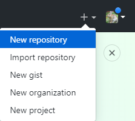
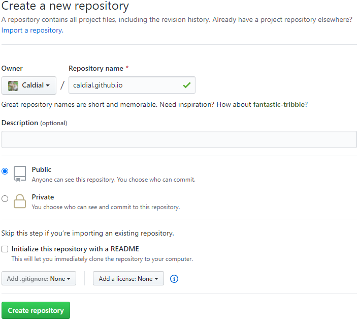
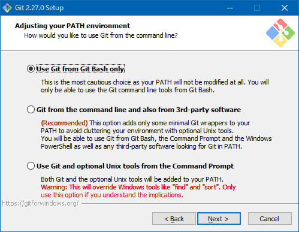
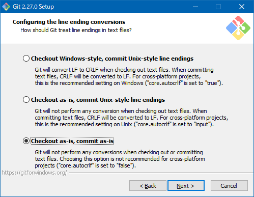
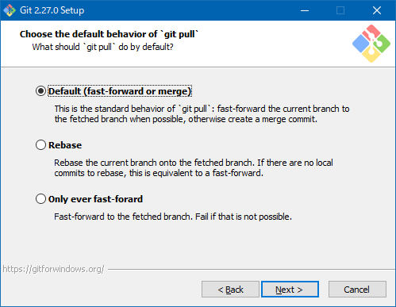
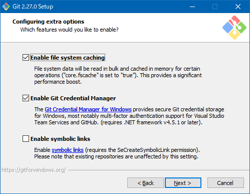
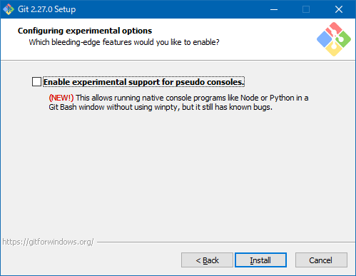
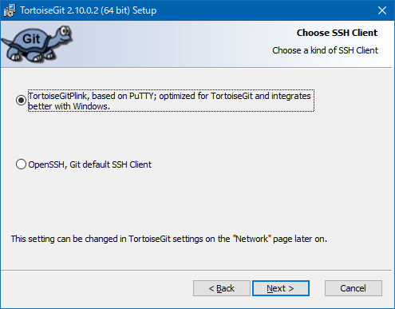
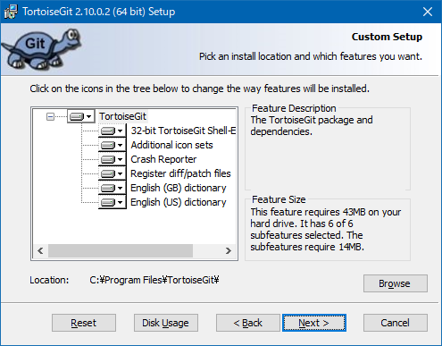

# GitHub Pagesを使う

技術資料の個人メモ代わりとして今までブログサービスを使っていましたが、今回はGitHubPagesを使ってみます。  
ブログのようなメニューを作成したり動的サイトの運用は難しいですが、簡単な日々のメモ書きだったり手書きホームページの代わり程度には利用できます。  
サービスそのものが履歴管理システムを内包しているため、変更管理が容易です。  
凝った表現はできませんが、技術資料を公開する程度なら気軽に利用できます。

|サービス|メリット|デメリット|
|----|----|----|
|自作ホームページ|レイアウトやJavaScriptの自由度が高い|マルチデバイス対応やページ全体の更新コストが高い|
|ブログ|気軽に記事を書ける|テンプレート以外のデザインが苦手|
|静的サイトジェネレータ|ページ全体の修正が楽|出来ることがマークダウンの範囲に限られる|
|GitHubPages|更新履歴がgitに内包されている|テンプレートデザイン以外の利用は難易度が高い|

## GitHubアカウントを作成

メールアドレスを登録してGitHubのアカウントを作成します。  
GitHubPagesはUsernameを含むURLになるため、URLを考慮した文字列にします。  
全角を含んでもリポジトリ名は小文字で作成できます。  
ちなみに2020年6月現在、GitHubは英語のみで日本語化などは出来ません。

## GitHubPages用リポジトリを作成

通常のGitHubリポジトリを作成する手順同様にブラウザ右上の[＋]から`New repository`を選択します。

リポジトリ名に`<UserName>.github.io`を入力します。  
公開範囲は`Public`になります。  
誰でもオリジナルを編集可能になるわけではありませんが、リポジトリ本体やソースファイル等は誰でもクローンできる状態で公開されます。
`Create repository`を押してgithubリポジトリを作成します。

## git for windows のインストール

https://gitforwindows.org/ から`git for windows`をダウンロードします。  

`Windows Explorer integration`はチェックを外します。

利用するテキストエディターを選択します。

Git利用をBashのみにします。

OpenSSLを利用します。

改行コードを自動変換しないように`Checkout as-is, commit as-is`を選びます。

`User MinTTY`を選択します。

`Default`を選択します。

標準のまま。

標準のまま。

## TortoiseGit のインストール

Windowsでgitを使うときはGUI操作が使える[TortoiseGit](https://tortoisegit.org/)（とーたすぎっと）が便利です。

そのままでは英語表記になるので[LanguagePack](https://tortoisegit.org/download/)もインストールします。

[目次に戻る](../index.md)
