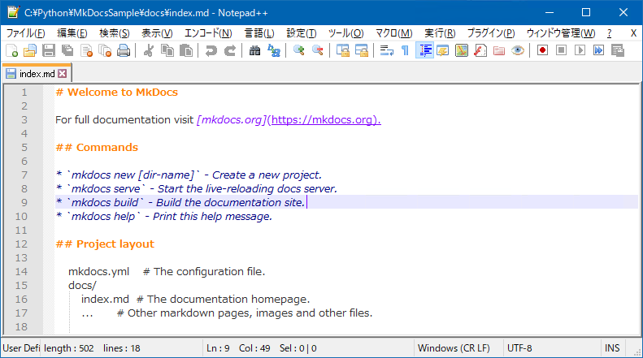
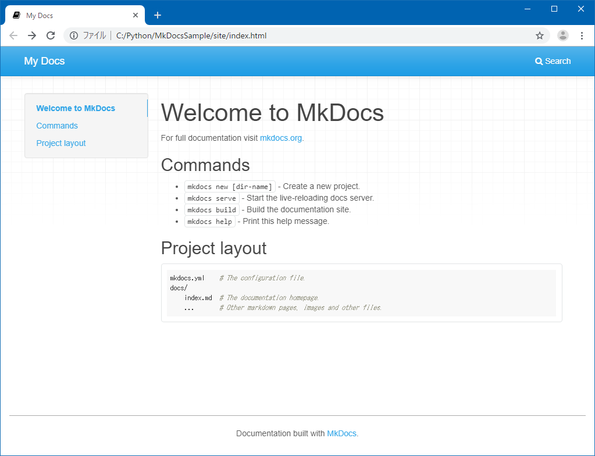
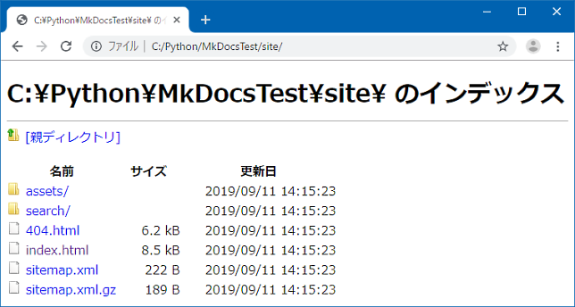

# MkDocsのインストール

## MkDocsのインストール

コマンドプロンプトから `py -m pip install mkdocs` を実行します。
環境変数PATHにPythonを登録せず、Pythonランチャー（`py.exe`）を利用している場合、コマンドプロンプトからの実行は `py -m` を付けます。

``` bat
Collecting mkdocs
  Downloading mkdocs-1.2.2-py3-none-any.whl (6.4 MB)
     |████████████████████████████████| 6.4 MB 6.4 MB/s
Collecting Markdown>=3.2.1
  Downloading Markdown-3.3.4-py3-none-any.whl (97 kB)
     |████████████████████████████████| 97 kB 3.4 MB/s
Collecting watchdog>=2.0
  Downloading watchdog-2.1.5-py3-none-win_amd64.whl (75 kB)
     |████████████████████████████████| 75 kB 1.9 MB/s
Collecting click>=3.3
  Downloading click-8.0.1-py3-none-any.whl (97 kB)
     |████████████████████████████████| 97 kB ...
Collecting mergedeep>=1.3.4
  Downloading mergedeep-1.3.4-py3-none-any.whl (6.4 kB)
Collecting ghp-import>=1.0
  Downloading ghp-import-2.0.1.tar.gz (11 kB)
Collecting packaging>=20.5
  Downloading packaging-21.0-py3-none-any.whl (40 kB)
     |████████████████████████████████| 40 kB ...
Collecting importlib-metadata>=3.10
  Downloading importlib_metadata-4.7.1-py3-none-any.whl (17 kB)
Collecting Jinja2>=2.10.1
  Downloading Jinja2-3.0.1-py3-none-any.whl (133 kB)
     |████████████████████████████████| 133 kB ...
Collecting PyYAML>=3.10
  Downloading PyYAML-5.4.1-cp39-cp39-win_amd64.whl (213 kB)
     |████████████████████████████████| 213 kB ...
Collecting pyyaml-env-tag>=0.1
  Downloading pyyaml_env_tag-0.1-py3-none-any.whl (3.9 kB)
Collecting colorama
  Downloading colorama-0.4.4-py2.py3-none-any.whl (16 kB)
Collecting python-dateutil>=2.8.1
  Downloading python_dateutil-2.8.2-py2.py3-none-any.whl (247 kB)
     |████████████████████████████████| 247 kB 6.4 MB/s
Collecting zipp>=0.5
  Downloading zipp-3.5.0-py3-none-any.whl (5.7 kB)
Collecting MarkupSafe>=2.0
  Downloading MarkupSafe-2.0.1-cp39-cp39-win_amd64.whl (14 kB)
Collecting pyparsing>=2.0.2
  Downloading pyparsing-2.4.7-py2.py3-none-any.whl (67 kB)
     |████████████████████████████████| 67 kB ...
Collecting six>=1.5
  Downloading six-1.16.0-py2.py3-none-any.whl (11 kB)
Using legacy 'setup.py install' for ghp-import, since package 'wheel' is not installed.
Installing collected packages: six, zipp, PyYAML, python-dateutil, pyparsing, MarkupSafe, colorama, watchdog, pyyaml-env-tag, packaging, mergedeep, Markdown, Jinja2, importlib-metadata, ghp-import, click, mkdocs
  WARNING: The script watchmedo.exe is installed in 'C:\Python\Python39\Scripts' which is not on PATH.
  Consider adding this directory to PATH or, if you prefer to suppress this warning, use --no-warn-script-location.
  WARNING: The script markdown_py.exe is installed in 'C:\Python\Python39\Scripts' which is not on PATH.
  Consider adding this directory to PATH or, if you prefer to suppress this warning, use --no-warn-script-location.
    Running setup.py install for ghp-import ... done
  WARNING: The script mkdocs.exe is installed in 'C:\Python\Python39\Scripts' which is not on PATH.
  Consider adding this directory to PATH or, if you prefer to suppress this warning, use --no-warn-script-location.
Successfully installed Jinja2-3.0.1 Markdown-3.3.4 MarkupSafe-2.0.1 PyYAML-5.4.1 click-8.0.1 colorama-0.4.4 ghp-import-2.0.1 importlib-metadata-4.7.1 mergedeep-1.3.4 mkdocs-1.2.2 packaging-21.0 pyparsing-2.4.7 python-dateutil-2.8.2 pyyaml-env-tag-0.1 six-1.16.0 watchdog-2.1.5 zipp-3.5.0
WARNING: You are using pip version 21.1.3; however, version 21.2.4 is available.
You should consider upgrading via the 'C:\Python\Python39\python.exe -m pip install --upgrade pip' command.
```

バージョンを確認します。

``` bat
C:\Users\NAME>py -m mkdocs -V
python -m mkdocs, version 1.2.2 from C:\Python\Python39\lib\site-packages\mkdocs (Python 3.9)
```

バージョンが表示されればインストール完了です。

## プロジェクトの新規作成

Pythonフォルダ直下に例として `MkDocsSample` プロジェクトを新規作成します。
プロジェクトフォルダが作成されて、中に `mkdocs.yml` ファイルと `docs` フォルダが作成されます。
`docs` フォルダには `index.md` ファイルが作成されます。

``` bat
C:\Users\NAME>cd C:\python
C:\python>py -m mkdocs new MkDocsSample
INFO    -  Creating project directory: MkDocsSample
INFO    -  Writing config file: MkDocsSample\mkdocs.yml
INFO    -  Writing initial docs: MkDocsSample\docs\index.md
```

index.mdはMarkdown形式のテキストファイルです。



## プロジェクトのビルド

プロジェクトをビルドするにはプロジェクトフォルダに `cd` で移動し、 `mkdocs build` コマンドでビルドします。
ビルドが成功すれば新規作成された `site` フォルダにファイル一式が出力されます。

``` bat
C:\Python>cd MkDocsSample
C:\Python\MkDocsSample>py -m mkdocs build
INFO    -  Cleaning site directory
INFO    -  Building documentation to directory: C:\Python\MkDocsSample\site
INFO    -  Documentation built in 0.22 seconds
```



mdファイルの修正や作成とbuildを繰り返して作業します。

## ローカルサーバーの起動

HTMLファイルのサイト内リンクはディレクトリパスを参照するため、リンク移動すると下記のようなディレクトリ画面が表示されてしまうため、サイト内の移動がやや面倒です。



`mkdocs serve` コマンドを使うとローカルでHTTPサーバサービスが起動します。
アドレスが表示される（下記では [http://127.0.0.1:8000](http://127.0.0.1:8000) ）のでWebブラウザで表示します。  
HTTPサーバサービスでは本来の挙動(サイト内リンクでindex.htmlが表示など)になります。  
また、サービス起動中はファイルの変更が自動的に反映されるため毎回ビルドしなくて済みます。

``` bat
C:\Python\MkDocsSample>mkdocs serve
INFO    -  Building documentation...
INFO    -  Cleaning site directory
[I 190901 12:34:56 server:296] Serving on http://127.0.0.1:8000
[I 190901 12:34:56 handlers:62] Start watching changes
[I 190901 12:34:56 handlers:64] Start detecting changes
```

終了させる場合はコマンドプロンプトを閉じるか、 ++ctrl+c++ を押します。

``` bat
[I 190901 12:35:00 server:318] Shutting down...
```

## 文字コードについて

MkDocsのファイルはUTF-8で作成します。  
Windows標準のメモ帳でテキストが空、もしくは**半角英数字で書かれたファイルに全角文字を追加して保存**した場合、**Shift_JIS**で保存されてしまうことがあります。
この状態でビルドすると**UnicodeDecodeError**となってしまいます。
その場合は保存時に文字コードをUTF-8に変更して上書き保存してください。

``` bat
C:\Python\MkDocsSample>mkdocs build
INFO    -  Cleaning site directory
INFO    -  Building documentation to directory: C:\Python\MkDocsSample\site
ERROR   -  Encoding error reading file: index.md
ERROR   -  Error reading page 'index.md': 'utf-8' codec can't decode byte 0x82 in position 8: invalid start byte
（省略）
UnicodeDecodeError: 'utf-8' codec can't decode byte 0x82 in position 8: invalid start byte
```
