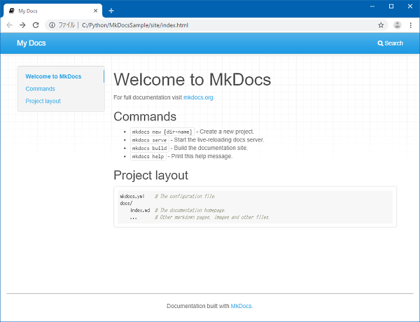
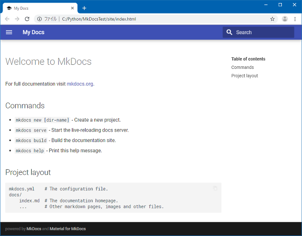

# Material for MkDocs のインストール

MkDocsではサイトの外観を変更できます。  
[MkDocs Themes](https://github.com/mkdocs/mkdocs/wiki/MkDocs-Themes) にサンプルがあります。  
本サイトでは見栄えがよくマテリアルデザインにも対応する人気テーマの[Material for MkDocs](https://squidfunk.github.io/mkdocs-material/) を紹介します。
本サイトもMaterialを使用しています。

## mkdocs-materialのインストール

Mkdocsと同じように `pip install mkdocs-material` でインストールします。 

``` bat
C:\Python>py -m pip install mkdocs-material
Collecting mkdocs-material
  Downloading mkdocs_material-5.2.2-py2.py3-none-any.whl (3.7 MB)
     |████████████████████████████████| 3.7 MB 6.8 MB/s
Collecting pymdown-extensions>=7.0
  Downloading pymdown_extensions-7.1-py2.py3-none-any.whl (205 kB)
     |████████████████████████████████| 205 kB ...
Collecting Pygments>=2.4
  Using cached Pygments-2.6.1-py3-none-any.whl (914 kB)
Collecting mkdocs-material-extensions>=1.0
  Downloading mkdocs_material_extensions-1.0-py3-none-any.whl (7.9 kB)
Requirement already satisfied: mkdocs>=1.1 in c:\python\python38-32\lib\site-packages (from mkdocs-material) (1.1.2)
Requirement already satisfied: markdown>=3.2 in c:\python\python38-32\lib\site-packages (from mkdocs-material) (3.2.2)
Requirement already satisfied: Jinja2>=2.10.1 in c:\python\python38-32\lib\site-packages (from mkdocs>=1.1->mkdocs-material) (2.11.2)
Requirement already satisfied: click>=3.3 in c:\python\python38-32\lib\site-packages (from mkdocs>=1.1->mkdocs-material) (7.1.2)
Requirement already satisfied: livereload>=2.5.1 in c:\python\python38-32\lib\site-packages (from mkdocs>=1.1->mkdocs-material) (2.6.1)
Requirement already satisfied: lunr[languages]==0.5.8 in c:\python\python38-32\lib\site-packages (from mkdocs>=1.1->mkdocs-material) (0.5.8)
Requirement already satisfied: PyYAML>=3.10 in c:\python\python38-32\lib\site-packages (from mkdocs>=1.1->mkdocs-material) (5.3.1)
Requirement already satisfied: tornado>=5.0 in c:\python\python38-32\lib\site-packages (from mkdocs>=1.1->mkdocs-material) (6.0.4)
Requirement already satisfied: MarkupSafe>=0.23 in c:\python\python38-32\lib\site-packages (from Jinja2>=2.10.1->mkdocs>=1.1->mkdocs-material) (1.1.1)
Requirement already satisfied: six in c:\python\python38-32\lib\site-packages (from livereload>=2.5.1->mkdocs>=1.1->mkdocs-material) (1.15.0)
Requirement already satisfied: future>=0.16.0 in c:\python\python38-32\lib\site-packages (from lunr[languages]==0.5.8->mkdocs>=1.1->mkdocs-material) (0.18.2)
Requirement already satisfied: nltk>=3.2.5; python_version > "2.7" and extra == "languages" in c:\python\python38-32\lib\site-packages (from lunr[languages]==0.5.8->mkdocs>=1.1->mkdocs-material) (3.5)
Requirement already satisfied: joblib in c:\python\python38-32\lib\site-packages (from nltk>=3.2.5; python_version > "2.7" and extra == "languages"->lunr[languages]==0.5.8->mkdocs>=1.1->mkdocs-material) (0.15.1)
Requirement already satisfied: regex in c:\python\python38-32\lib\site-packages (from nltk>=3.2.5; python_version > "2.7" and extra == "languages"->lunr[languages]==0.5.8->mkdocs>=1.1->mkdocs-material) (2020.5.14)
Requirement already satisfied: tqdm in c:\python\python38-32\lib\site-packages (from nltk>=3.2.5; python_version > "2.7" and extra == "languages"->lunr[languages]==0.5.8->mkdocs>=1.1->mkdocs-material) (4.46.1)
Installing collected packages: pymdown-extensions, Pygments, mkdocs-material-extensions, mkdocs-material
  WARNING: The script pygmentize.exe is installed in 'C:\Python\Python38-32\Scripts' which is not on PATH.
  Consider adding this directory to PATH or, if you prefer to suppress this warning, use --no-warn-script-location.
Successfully installed Pygments-2.6.1 mkdocs-material-5.2.2 mkdocs-material-extensions-1.0 pymdown-extensions-7.1
WARNING: You are using pip version 20.0.2; however, version 20.1.1 is available.
You should consider upgrading via the 'C:\Python\Python38-32\python.exe -m pip install --upgrade pip' command.
```

## mkdocs.ymlへの適用

`mkdocs.yml`ファイルに以下の内容を追記します。

```yaml
theme:
    name: 'material'
```

ビルドすることでデザインが変化します。




## Materialの拡張設定

Materialテーマは他にも設定変更ができます。
本サイトではmkdocs.ymlの設定例について利用頻度の高いものを日本語のコメントにて紹介します。  
詳細は公式サイトの[Getting started - Material for MkDocs](https://squidfunk.github.io/mkdocs-material/getting-started/) を参照ください。

``` yaml
theme:
    # 使用するテーマ名
    name: 'material'
	# 標準言語。日本語の場合は'ja'（jpではない）
    language: 'ja'
	# サイトヘッダー画像
    logo: 'images/logo.svg'
	# サイトアイコン画像
	favicon: 'assets/images/favicon.ico'
	# 使用可能色は定義された21色
	#    red, pink, purple, deep purple, indigo, blue, light blue, cyan,
    #    teal,	green, light green, lime, yellow, amber, orange,
    #    deep orange,	brown, grey, blue grey, white
    palette:
	    # ヘッダーの色。標準は'indigo'
        primary: 'indigo'
	    # ハイライト文字の色。標準は'indigo'。
        accent: 'indigo'
	# フォント。'font: false'にするとGoogleフォントを使用しなくなる
    font:
        text: 'Roboto'
        code: 'Roboto Mono'

extra:
    # Materialデザインのアイコン拡張
    logo:
        # 利用可能なアイコンは以下を参照
		# https://material.io/resources/icons/?icon=description&style=baseline
        icon: 'developer_board'
    # ウェブアプリマニフェストを有効化
	# Web App Manifestについては他サイトを参照
    manifest: 'manifest.webmanifest'

markdown_extensions:
    # !!! を使って文書内に見やすいスタイルを使う（Markdownのサンプルを参照）
    - admonition
    # [^1] を使って注釈を使う（Markdownのサンプルを参照）
    - footnotes
    # コードハイライトを使う
    - codehilite:
	    # 言語を表記する
        guess_lang: true
        # 行数を表示
        linenums: true
```
