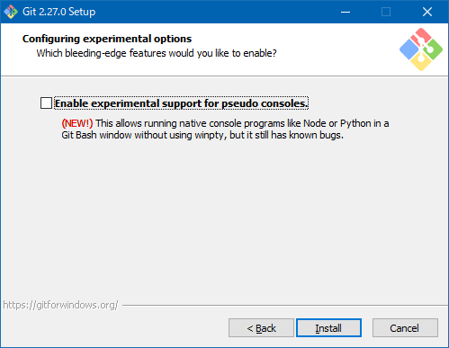

# GitHub Pagesを使う

技術資料の個人メモ代わりとして今までブログサービスを使っていましたが、今回はGitHubPagesにチャレンジしてみました。  
ブログのようなメニューを作成したり動的サイトの運用は難しいですが、簡単な日々のメモ書きだったり手書きホームページの代わり程度には利用できます。  
また、サービスそのものが履歴管理システムを内包しているため、変更管理が容易です。

|サービス|メリット|デメリット|
|----|----|----|
|ホームページ|レイアウトやJavaScriptの自由度が高い|マルチプラットフォーム
|静的サイト|
|GitHubPages|
|ブログ|

## GitHubアカウントを作成

メールアドレスを登録してGitHubのアカウントを作成します。  
GitHubPagesはUsernameを含むURLになるため、URLを考慮した文字列にします。  
全角を含んでもリポジトリ名は小文字で作成できます。  
ちなみに2020年6月現在、GitHubは英語のみで日本語化などは出来ません。

## GitHubPages用リポジトリを作成

通常のGitHubリポジトリを作成する手順同様にブラウザ右上の[＋]から`New repository`を選択します。

リポジトリ名に`<UserName>.github.io`を入力します。  
公開範囲は`Public`になります。  
誰でもオリジナルを編集可能になるわけではありませんが、リポジトリ本体やソースファイル等は誰でもクローンできる状態で公開されます。
`Create repository`を押します。

「次へ」を押します。

[目次に戻る](../index.md)
