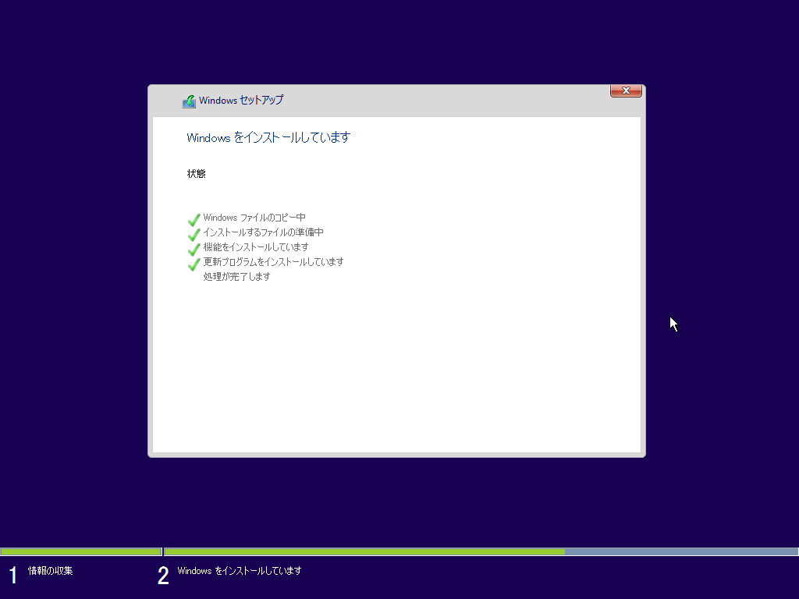

# Windows10 (1511) インストール

このページでは`Windows10 Pro(1511)`のインストールについて解説します。

「次へ」を押します。

「今すぐインストール」を押します。

`プロダクトキーがありません`を選択してスキップします。  
この後の設定でハードウェア構成が大きく変更されたり、OSを再インストールする事態になった場合に再アクティベーションが必要になってしまうため、プロダクトキーの入力はOSやドライバーのインストールが一段落した段階で入力します。

「同意します」を押します。

「カスタム：Windowsのみをインストールする（詳細設定）」を押します。

新規パーティションを作成します。

インストールが実行されます。

15秒待つか、「今すぐ再起動」を押します。

「設定のカスタマイズ」を押します。

設定を共有したりMicrosoftに送信しないようにします。  
全ての設定をオフにします。

全ての設定をオフにします。

全ての設定をオフにします。

「私が所有しています」を選びます。

ローカルアカウントを使うため「この手順をスキップする」にチェックを入れます。

ユーザー名とパスワードを設定します。

ネットワークの設定は「はい」を選択します。

これでOSのインストールは完了です。

[目次に戻る](../index.md)
