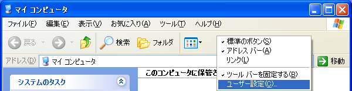
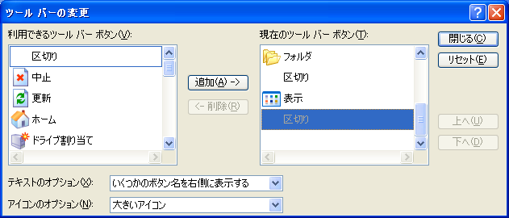
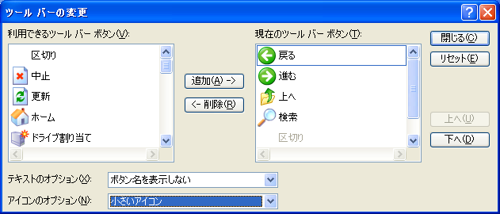
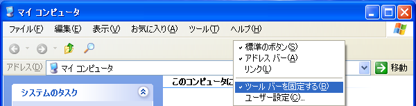
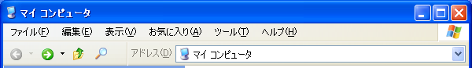

# WindowsXPのエクスプローラーをスリム化する

WindowsXPのエクスプローラーのツールバーはサイズが過大なので利便性を高めるためにスリム化します。

`マイコンピュータ`を開き、ツールバーを右クリックして`ユーザー設定`を選択します。

以下のように変更します。

|設定|デフォルト|変更後|
|----|----|----|
|ツールバーボタン|戻る 進む 上へ 区切り 検索 フォルダ 区切り 表示 区切り|戻る 進む 上へ 検索 区切り|
|テキストのオプション|いくつかのボタン名を右側に表示する|ボタン名を表示しない|
|アイコンのオプション|大きいアイコン|小さいアイコン|

ツールバーの変更を閉じて再度エクスプローラーのツールバーを右クリックして`ツールバーを固定する`のチェックを外します。  
2段目のアドレスバーを1段目のツールバーにドラッグアンドドロップで移動させます。  
移動後に再び`ツールバーを固定する`にチェックを入れてツールバーを固定します。

[目次に戻る](../)
