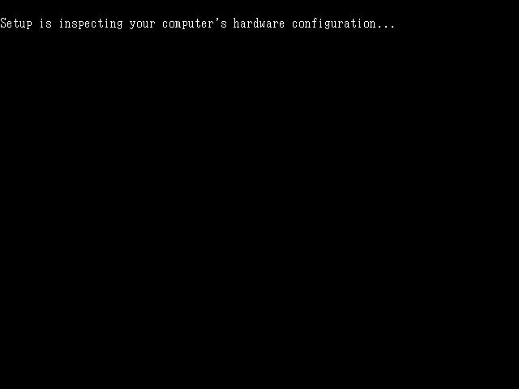
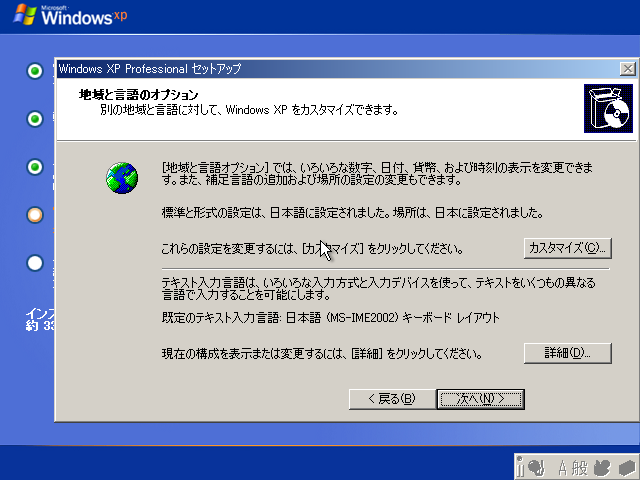

# WindowsXPのインストール

このページでは`WindowsXP Professional SP3`のOSインストールについて解説します。

OSのディスクを入れると  
`Setup is inspecting your computer's hardware configration...`  
と表示されるのでしばらく待ちます。

SCSIやRAIDドライバーを読み込ませたい場合は下記画面で `F6` を押します。  
IDEやAHCIを利用する場合は何もせずに待ちます。

WindowsXPの新規インストールは［Enter］を押します。

［F8］を押します。

 
［半角/全角］キーを押します。

 
［Y］を押します。

 
パーティションを複数作成するかどうかを選択します。  
［C］を押してパーティションを作成するとD：やＥ：が作成できます。  
「未使用領域」をそのまま選択するとC：ドライブのみ作成されます。

 
初回フォーマット方法を選択します。
通常は「NTFSファイルシステムを使用してパーティションをフォーマット（クイック）」を選択します。（通常フォーマットは数時間以上掛かるため注意してください）

フォーマットが開始されるのでしばらく待ちます。
 

ディスク検査が始まります。

ドライブにOSファイルがコピーされます。

ドライバーのインストールが行われます。

コンピュータの再起動を促されます。
15秒間そのままにするか、［Enter］を押すと再起動します。

WindowsXPのロゴが表示されます。
この画面が表示されずに最初の黒画面が表示される場合、コンピュータのドライブ読み込み順がディスク優先に設定されています。
その場合はBIOSで読み込み順をドライブ優先に再設定してください。

しばらく自動で進みます。

「次へ」を押します。

ユーザー名を入力します。組織名は空欄でOKです。
 

「次へ」を押してスキップします。  
この後の設定でハードウェア構成が大きく変更されたり、OSを再インストールする事態になった場合に再アクティベーションが必要になってしまうため、
プロダクトキーの入力はOSやドライバーのインストールが一段落した段階で入力します。
 

「いいえ」を押します。

コンピューター名とAdministratorのパスワードを入力します。
 

「次へ」を押します。
 

しばらく自動で進みます。

OKを押します。

 
解像度が変更されるのでダイアログが見えれば「OK」を押します。
この時点ではグラフィックドライバーが登録されていないので、最適な解像度ではありません。
 

右下の「次へ」を押します。
 

「後で設定します」を選択します。
最初のWindowsUpdateは手動で行うためです。
自動を選択すると手動アップデートが自動アップデートと競合して上手くできない場合があります。
また、2014年4月9日以降はWindowsXPのサポート期限が切れているため自動アップデートは出来ません。
 

ユーザー名を設定します。
日本語名も利用可能ですが、一部プログラムが正しく動かないなどの情報もあるため、英数字を推奨します。
パスワードは後ほど設定します。
 

「次へ」を押します。
 

これでOSインストールは完了です。
OSのディスクを取り出してください。
 

引き続き、OSの初期設定に進みます。

[目次に戻る](../)
